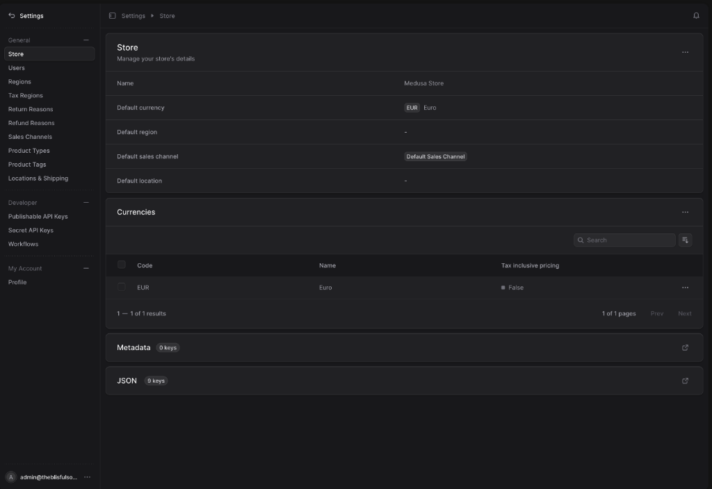
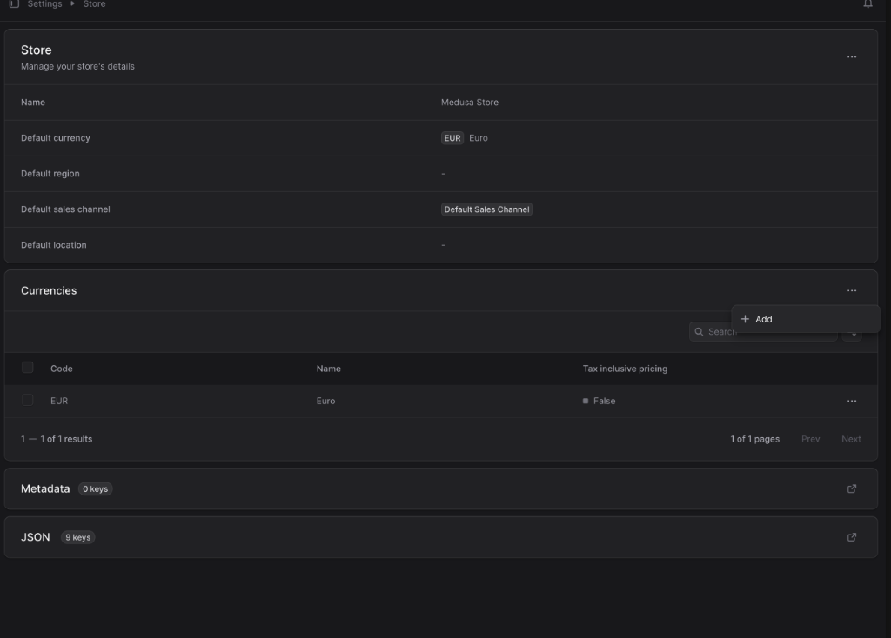
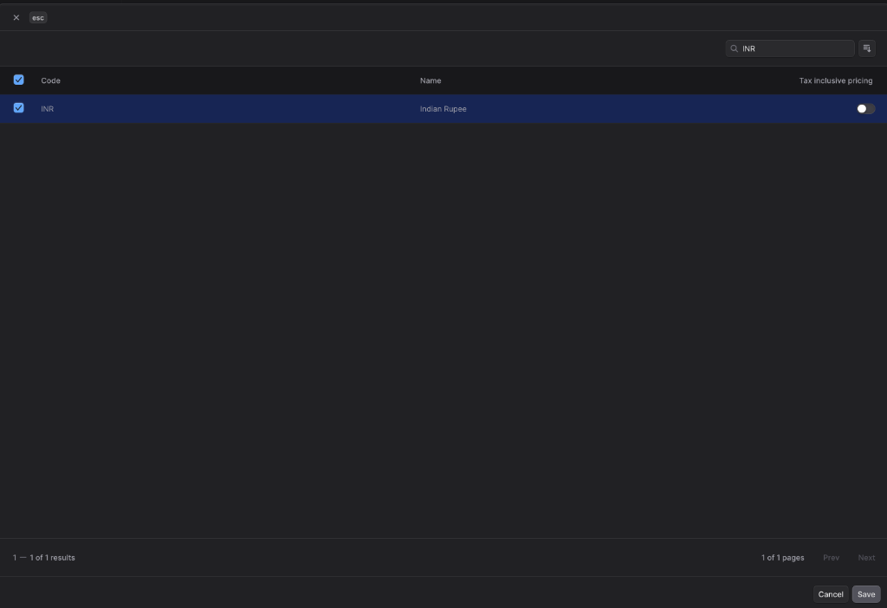
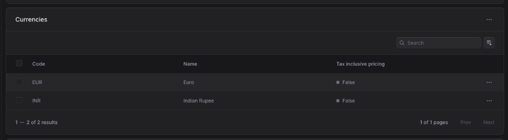
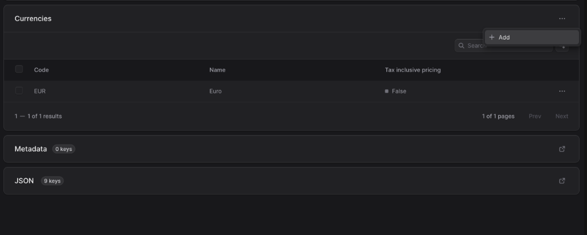
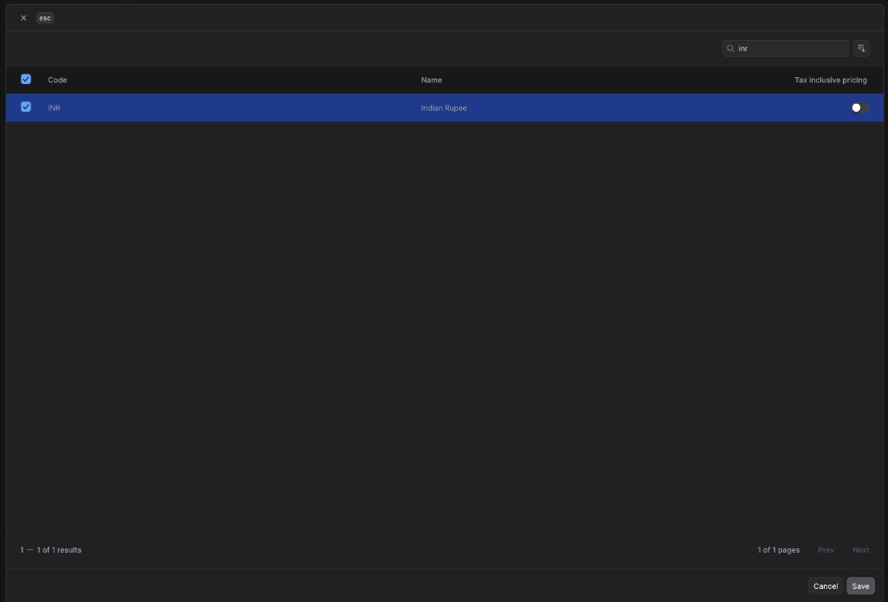
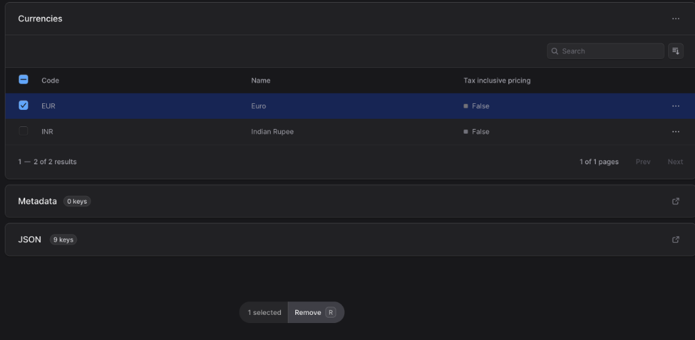
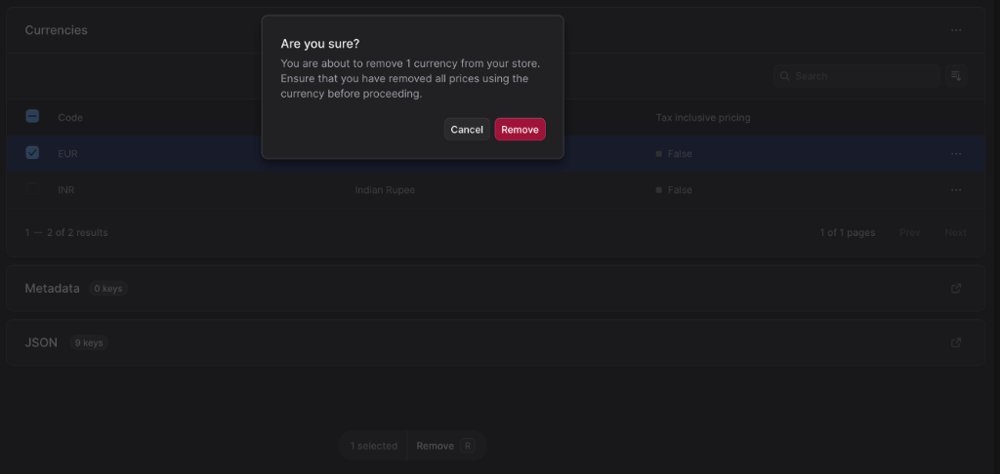

# 💰 How to Update and Configure Store Currencies

This guide walks you through the steps to add a new currency (like INR), set it as the store's default, and safely remove the old default currency (like EUR) from your Medusa dashboard.

---

### Step 1: Open Store Settings
1. Log into your Medusa Admin dashboard.
2. In the left-hand sidebar menu, click on **Settings**.
3. Under the *General* section, select **Store**.
4. Scroll down to the **Currencies** section at the bottom of the page.

---

### Step 2: Add a New Currency
1. In the **Currencies** section, click on the **three dots (`...`)** menu on the right.
2. Select **`+ Add`** from the dropdown menu.

---

### Step 3: Search and Select New Currency
1. A modal will appear. In the search bar at the top right, type the currency code you want to add (e.g., **`INR`**).
2. Look for your currency (e.g., `Indian Rupee`) in the list below and **check the box** next to it.
3. Click the **Save** button in the bottom right corner of the modal.

---

### Step 4: Verify the New Currency is Added
You will now see both your new currency (`INR`) and your previous currency (`EUR`) listed in the Currencies section.

> **Important Setup Note:** 
> Before you can remove the old currency (`EUR`), you **must** change the default currency of the store to the new one (`INR`), and verify no existing Regions are still using the old currency! Go to **Settings > Regions** to assign `INR` first.

---

### Step 5: Set New Currency as Default
Now that `INR` is added, you need to set it as your store's primary currency.

1. Scroll back up to the top **Store** panel.
2. Click the **three dots (`...`)** menu on the far right.
3. Select **Edit** to open the Edit Store modal.

4. In the modal, click the **Default currency** dropdown field.
5. Select your newly added currency (**`INR`**).
6. Click **Save** at the bottom.

---

### Step 6: Remove the Existing/Old Currency
Once your new currency is set as the default across your store and regions:
1. Go back to the **Currencies** section list.
2. Check the **checkbox** on the left side of the currency you want to remove (e.g., `EUR`).
3. A floating action bar will appear at the bottom of the screen. Click the **Remove** button.

4. A confirmation dialog will pop up asking "Are you sure?". Click the red **Remove** button to finalize the deletion.

---

🎉 **Done!** Your store is now fully configured to operate using your new localized currency.
