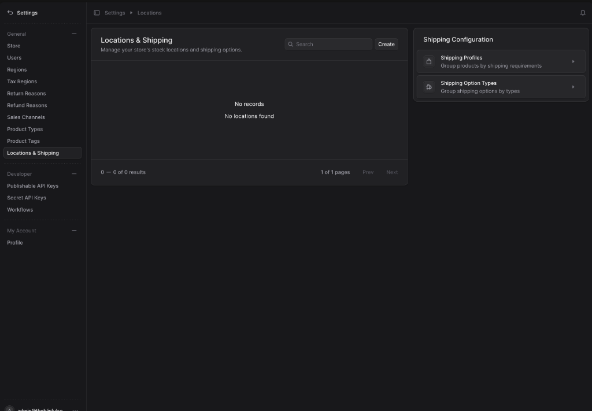
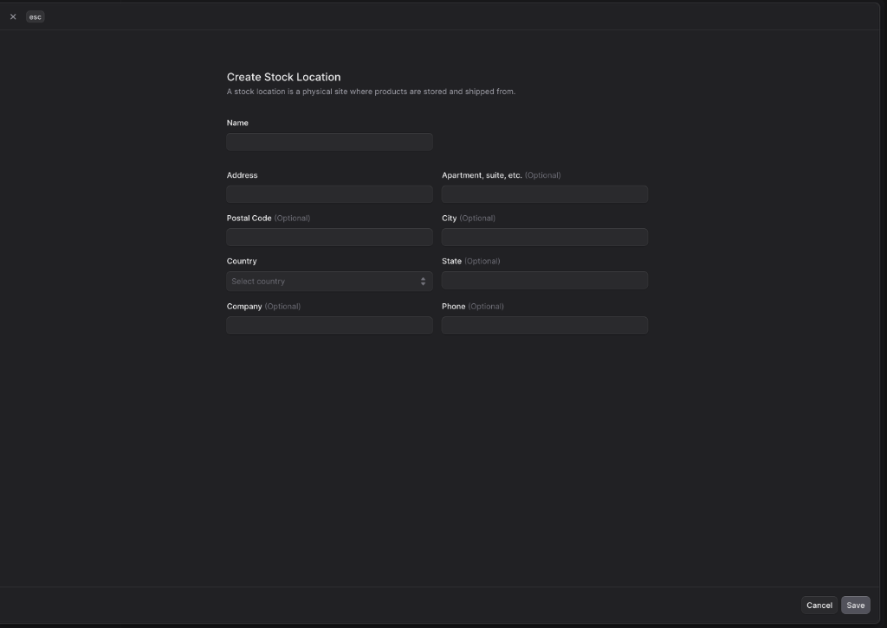
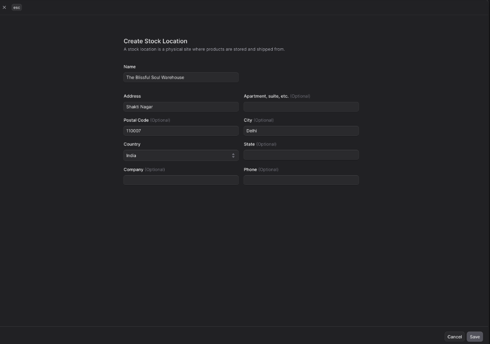
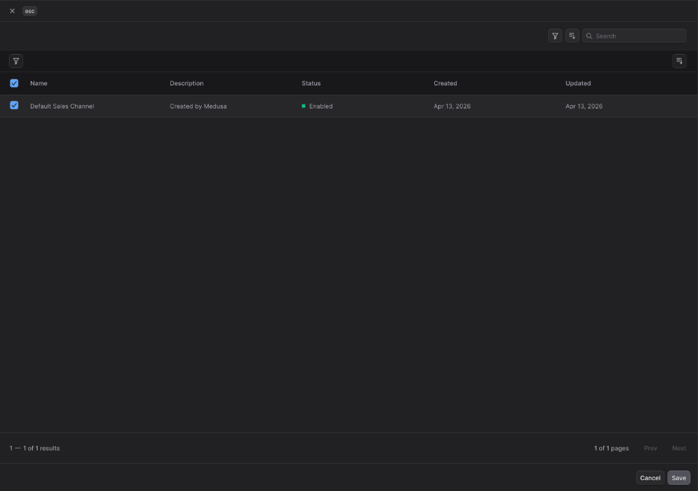
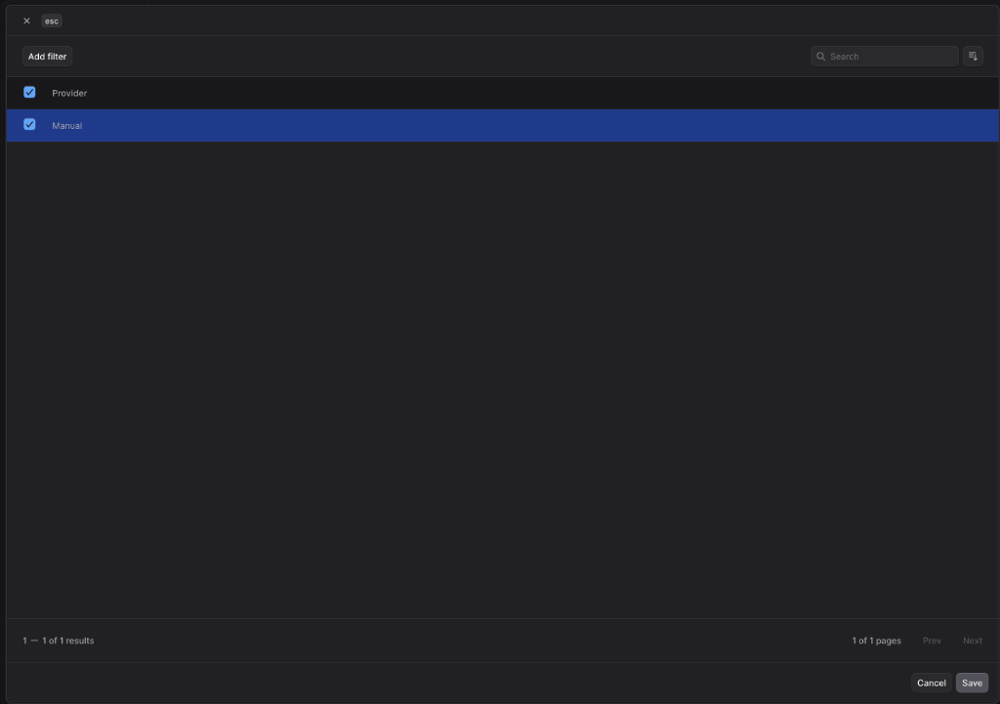

# 📦 How to Configure Locations & Shipping

This guide explains how to set up your stock locations, fulfillment providers, and sales channels to ensure your store can fulfill orders correctly. This is a critical step to perform after setting up your **Regions**.

---

### Step 1: Open Locations & Shipping Settings
1. Log into your Medusa Admin dashboard.
2. Click on **Settings** in the left-hand sidebar menu.
3. Under the *General* section, select **Locations & Shipping**.

---

---

### Step 2: Create a Stock Location
A stock location represents a physical site (like a warehouse or store) where your products are stored and shipped from.

1. Click the **Create** button in the top right of the "Locations & Shipping" card.
2. A "Create Stock Location" modal will appear.

---

### Step 3: Enter Location Details
Fill in the necessary details for your warehouse:
1. **Name:** Enter a descriptive name (e.g., `The Blissful Soul Warehouse`).
2. **Address:** Enter the street address (e.g., `Shakti Nagar`).
3. **City & Postal Code:** Enter the city (e.g., `Delhi`) and postal code (e.g., `110007`).
4. **Country:** Select the country from the dropdown (e.g., `India`).
5. Click **Save**.

---

### Step 4: Add Sales Channels to the Location
You must specify which sales channels can use this location for inventory.

1. Once the location is created, click on it to open its settings.
2. Look for the **Sales Channels** section and click the **Create** or **Add** button.
3. In the modal, select your **Default Sales Channel**.
4. Click **Save**.

---

### Step 5: Configure Fulfillment Providers
Fulfillment providers are the services that will handle the shipping process.

1. Within the location settings, find the **Fulfillment Providers** section.
2. Click the **Add** button.
3. Select the active provider(s) you wish to use (e.g., `Manual`).
4. Click **Save**.

---

### Step 6: Verify Shipping Profiles
Shipping profiles help you group products by their shipping requirements. 
1. On the main **Locations & Shipping** page, you can manage **Shipping Profiles** and **Shipping Option Types** in the right-hand sidebar.
2. Ensure you have a "Default Profile" created and all your products are assigned to it.

---

### Next Steps
Now that your location is set up, you can go back to **Settings > Regions** to define specific shipping options and rates for each region! 🚀
