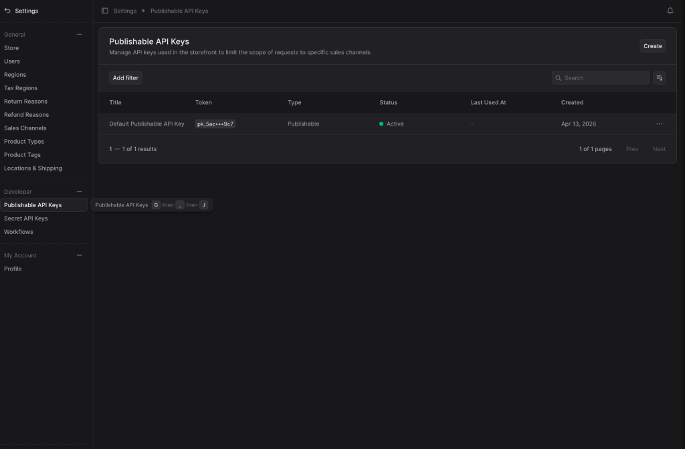
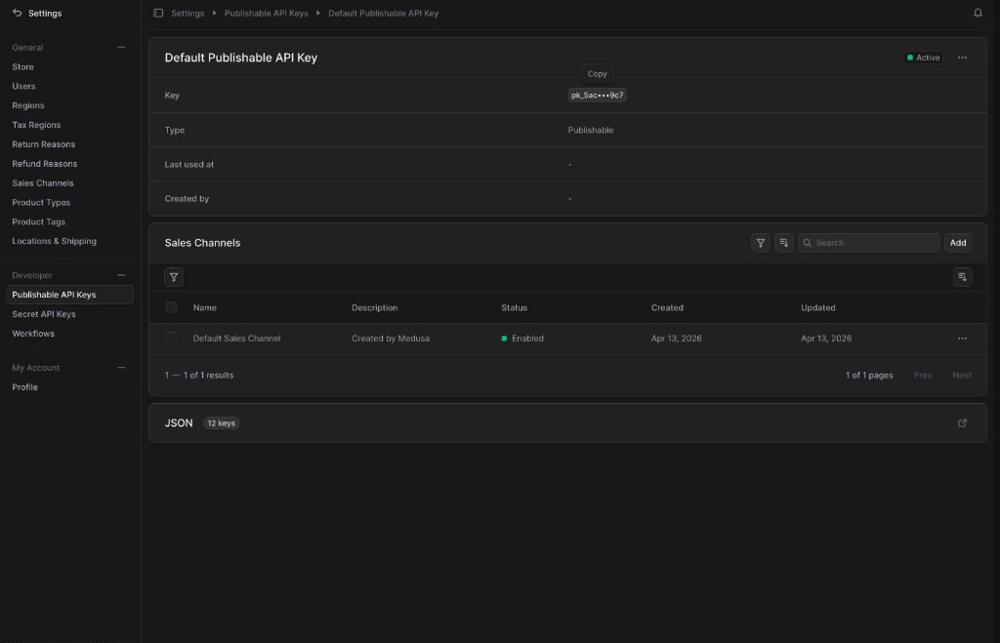
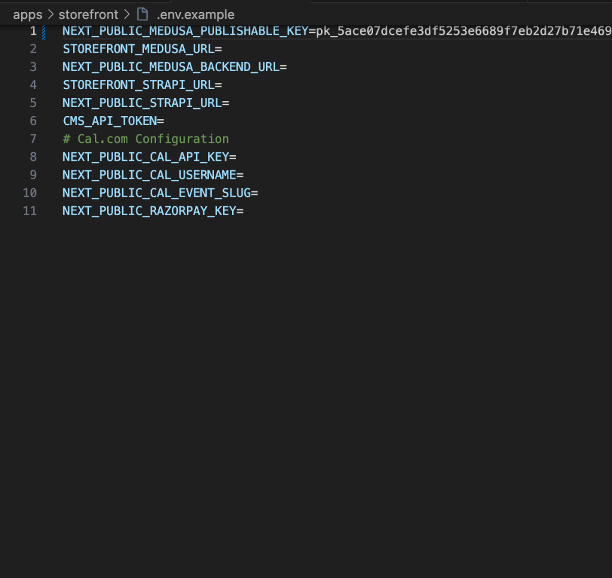

# 🔑 How to Setup Publishable API Keys

This guide walks you through finding, copying, and configuring your Medusa Publishable API key into your Storefront. This is required for your Next.js storefront to securely fetch products, regions, and cart data.

---

### Step 1: Open Publishable API Keys
1. Log into your Medusa Admin dashboard.
2. In the left-hand sidebar menu under *Developer*, click on **Publishable API Keys**.
3. You will see a list of your keys. Medusa usually creates a "Default Publishable API Key" out of the box.



---

### Step 2: Copy the Token & Verify Sales Channels
1. Click on the **Default Publishable API Key** (or create a new one).
2. Hover over the **Key** value (`pk_...`) and click the **Copy** button.
3. Scroll down to the **Sales Channels** section on the same page.
4. Ensure that the **Default Sales Channel** is explicitly added and enabled here! If you do not attach the Sales Channel, the storefront's API requests will return 404 errors.



---

### Step 3: Add the Key to Your Storefront `.env`
1. Open your code editor.
2. Navigate to your storefront folder where your environment variables are stored (e.g. `apps/storefront/.env` or `.env.example`).
3. Find the `NEXT_PUBLIC_MEDUSA_PUBLISHABLE_KEY` variable.
4. Paste the `pk_...` token you just copied.



---

### Step 4: Rebuild the Storefront
Since this is a public environment variable in a Next.js application, you need to restart or rebuild the storefront service for the changes to take effect:

```bash
docker-compose up -d --build storefront
```

Your storefront is now authenticated and ready to fetch data!
