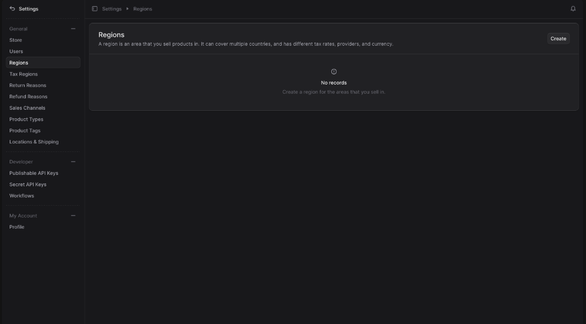
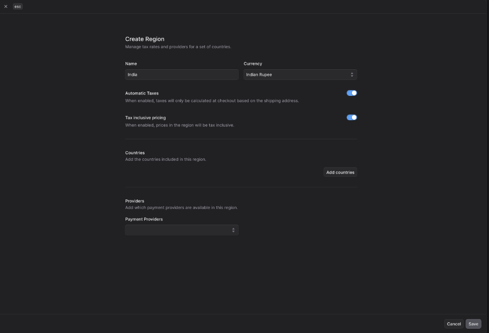
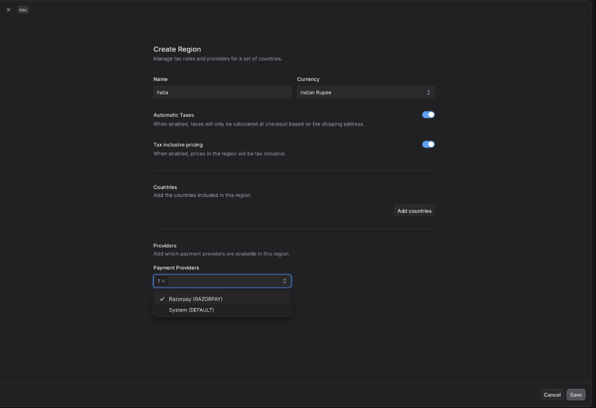
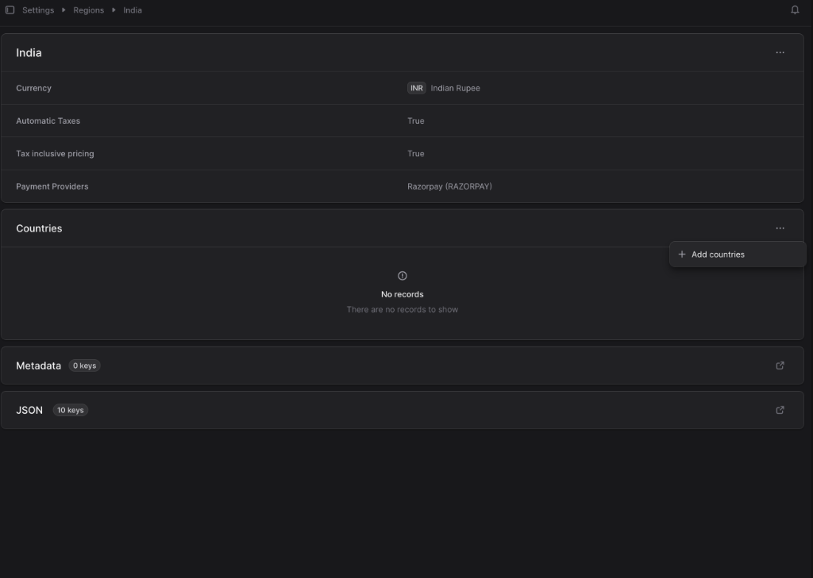
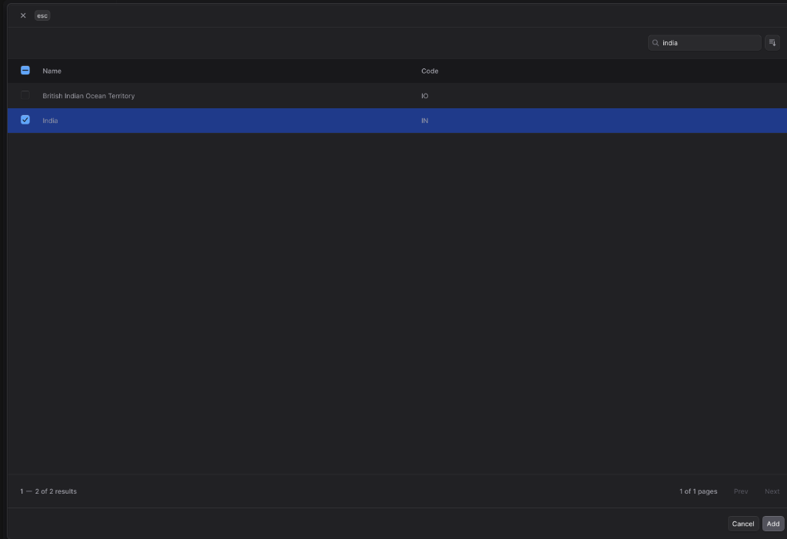
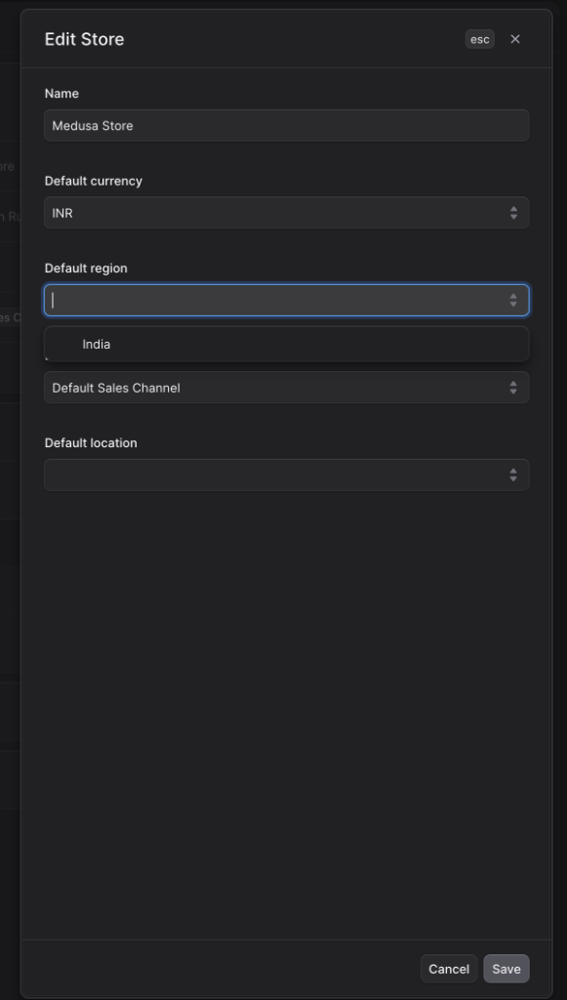

# 🌍 How to Add and Configure Store Regions

This guide walks you through the steps to set up a new region (e.g., India) and assign your preferred currency, countries, and providers to it in your Medusa dashboard.

---

### Step 1: Open Region Settings
1. Log into your Medusa Admin dashboard.
2. In the left-hand sidebar menu, click on **Settings**.
3. Under the *General* section, select **Regions**.

---

---

### Step 2: Create a New Region
1. In the top right corner of the Regions page, click the **Create** button.
2. A new "Create Region" modal will slide out allowing you to configure your new region.

---

### Step 3: Configure Region Details
Fill in the necessary details for your new region:
1. **Name:** Enter a descriptive name for the region (e.g., `India`).
2. **Currency:** Select the default currency for this region (e.g., `Indian Rupee`). 
   > *(Note: You must have already added this currency in your Store Settings! If you haven't, see the [Currency Setup Guide](./currency_setup_guide.md) first).*
3. **Automatic Taxes / Tax inclusive pricing:** Toggle these based on your region's tax compliance requirements.
4. **Providers:** In the Payment Providers dropdown, select your active integrations (e.g., `Razorpay (RAZORPAY)`).

---

### Step 4: Save the Region
1. Click the **Save** button at the bottom of the pane.
2. Your newly created region will now open up showing its full details page.

---

### Step 5: Add Countries to the Region
Before your region can actively be used at checkout, you must assign countries to it!
1. Scroll down to the **Countries** section on the region's detail page.
2. Click the **+ Add countries** button on the right.

3. A modal will slide out. Use the search bar to find your country (e.g., "India").
4. Check the checkbox next to the country to select it.
5. Click **Add** at the bottom right.

---

### Step 6: (Crucial) Link Region to Your Publishable API Keys!
> **Important:** Creating a region is only half the battle. To actually view products localized in this region on your live storefront, you **must** expose the region via your API keys.

1. Go to **Settings** > **Publishable API Keys** (under *Developer*).
2. Click on your active key (e.g., `Main Storefront`).
3. Under the **Sales Channels** or **Regions** section attached to that key, make sure your new Region or associated Sales Channel is selected.
4. If this step is missed, the storefront API won't render any prices for the new currency/region!

---

### Step 7: Update Store Defaults
Once your currency and region are created, make sure your entire store uses them natively out of the box:
1. Go to **Settings** > **Store**.
2. Click the **Edit** option (usually under a `...` menu or in the top right).
3. Set your **Default currency** to the one you just configured (e.g., `INR`).
4. Set your **Default region** to the newly created one (e.g., `India`).
5. Click **Save**.

