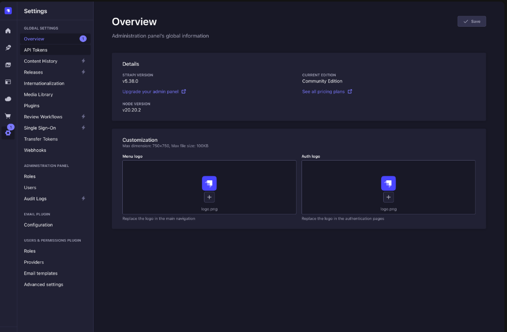
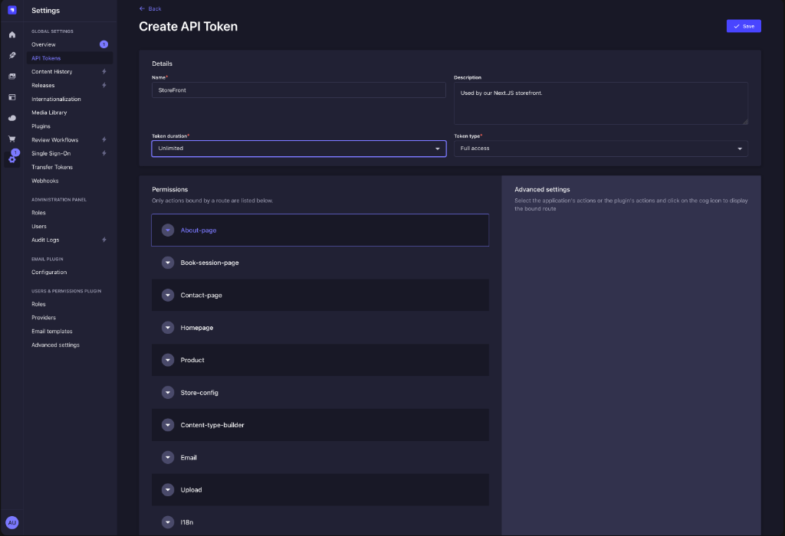
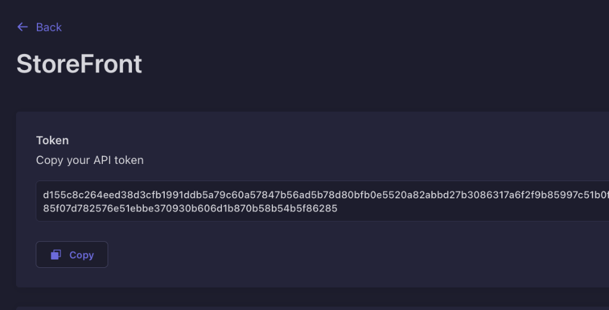
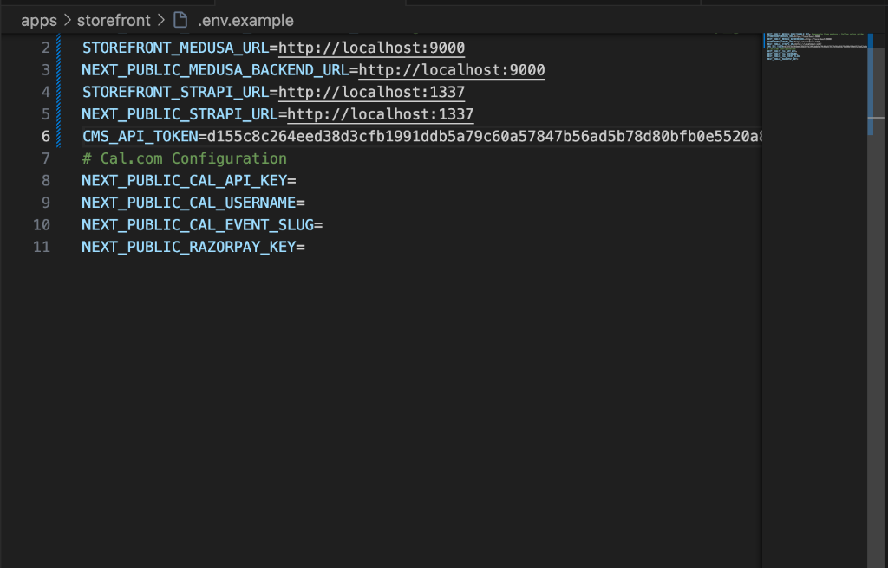

# 🔑 How to Setup Strapi CMS API Tokens

This guide walks you through finding, generating, and copying a Strapi API token so that your storefront can securely fetch pages, headers, footers, and other block variations.

---

### Step 1: Open Strapi Settings
1. Log into your Strapi Admin dashboard (usually `http://localhost:1337/admin`).
2. At the bottom left of the main sidebar menu, click on **Settings**.

---

### Step 2: Navigate to API Tokens
1. Under the **Global Settings** heading in the left menu, click on **API Tokens**.
2. If this is a fresh setup, the list will be empty. Click the **Create new API Token** button at the top right of the page.

---

### Step 3: Configure Token Details
1. **Name:** Enter a descriptive name like `Storefront`.
2. **Description (Optional):** Enter something like "Access token for the Next.js Storefront".
3. **Token duration:** Click the dropdown and select **`Unlimited`** to ensure your storefront connection does not spontaneously expire.
4. **Token type:** Click the dropdown and select **`Full Access`**. 
   > *(Note: Alternatively, if you want strictly-typed permissions, you can choose `Custom` and explicitly tick "find" and "findOne" for all relevant collections under the APIs section, but `Full Access` is the simplest method for early development).*

---

### Step 4: Save & Copy the Token
1. Click the **Save** button in the top right corner.
2. The page will reload and your new token will be revealed in a secure green/blue box at the top of the screen.
3. **Warning!** You can only view this full token string ONCE. 
4. Click the copy icon next to the token to copy the long alphanumeric string to your clipboard.

---

### Step 5: Update Storefront Environment Variables
1. Open your code editor and navigate to `apps/storefront/.env` (or `.env.example` if generating defaults).
2. Locate the line for `CMS_API_TOKEN`.
3. Paste the token you just copied so it looks like this:
   `CMS_API_TOKEN=your_long_copied_token_here`

You rebuild the storefront to inject it, and your Storefront now has authorization to read data natively from Strapi!
